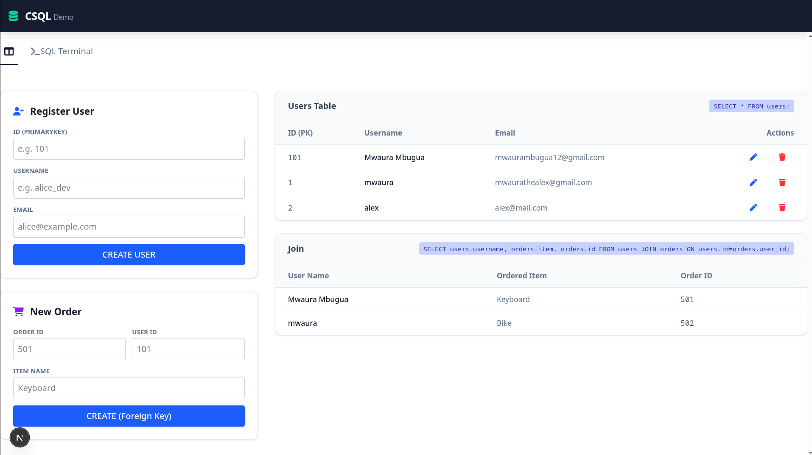
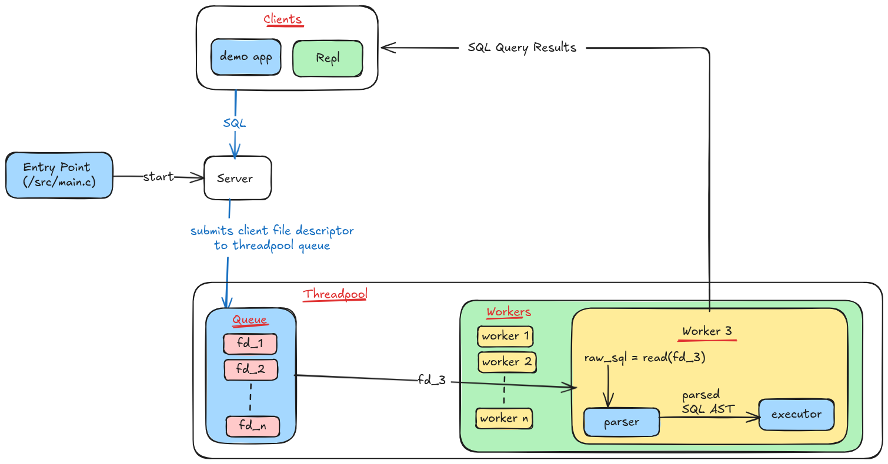
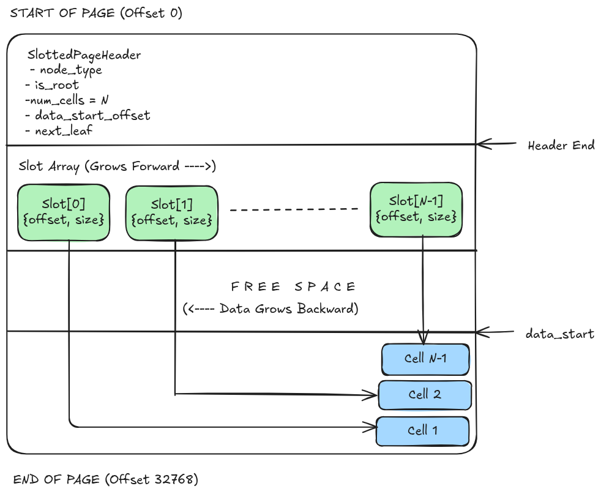
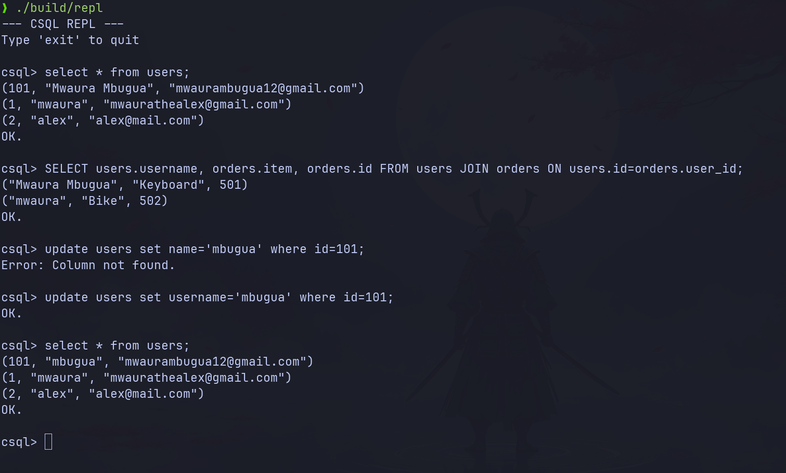
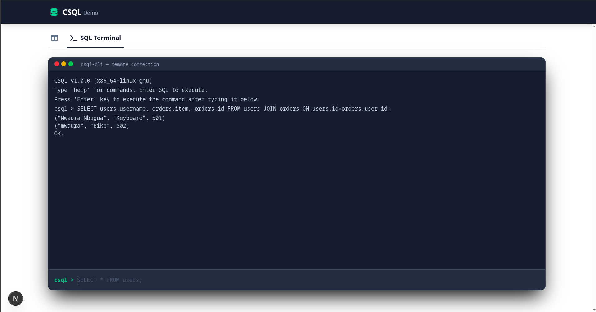

# CSQL

A relational database management system (RDBMS) built in C

This project is for educational purposes only.

## Building and Running

Testing has only been done on linux machines. Ensure you have a C compiler
( clang or gcc ) and Node JS installed for the demo app.

### 1. Building

Run the build script to compile both the Database Server and the REPL.

`./build.sh`

This creates the `build/` directory containing 2 executables:

- `csql`: The database server
- `repl`: The command line client

### 2. Starting the Server

In terminal, start the database server. It will listen on port 9000

`./build/csql`

Keep the terminal window open.

### 3. Run the Clients

- **A. CLI Repl**
Open a new terminal and run the command:

`./build/repl`

- **B. Web App Demo**

1. go to the demo folder

`cd demo_app`

2. install dependencies

`npm install`

3. start the frontend

`npm run dev`

4. Open `http://localhost:3000` on your browser.

## Features

[x] Declaring tables with a few column data types
[x] CRUD operations
[x] Joining
[x] Basic indexing
[x] Primary and unique keying
[x] SQL Interface
[x] Interactive Repl Mode

## Also included

[x] Web App demo
[x] Repl

## Overall architecture

### 1. [Entry Point (main.c)](src/app/main.c)

This calls the `server_start` implemented in `/src/app/server.c`

### 2. [Server (server.c)](src/app/server.c)

server.c contains one function, `server_start` which:

- Initializes a global memory arena to manage memory for the entire server
lifecycle. e.g. caching tables, pages and indexes in the database.
- Allocates a `Database` struct within the global arena and opens the database
file `csql.db`, creates it if it does not exist.
- Initializes a Mutex `db->lock` to ensure that database access is thread safe.
- For a new database, it initializes the first page as the Catalog Root, else
it loads existing table definitions from disk `catalog_init_from_disk`. The
catalog is used to store table definitions for easier table lookup, e.g. during
inserts.
- Initializes a threadpool `conn_pool` which manages worker threads to handle queries
in parallel.
- Creates a TCP socket.
- It finally enters into an infinite loop that blocks waiting for new connections.
- When a connection is received, the client socket `client_fd` is handed over to
the threadpool using the `thread_pool_submit` function and the server goes back
to waiting for the next connection.

### 3. Threadpool

- The threadpool includes `thread_pool_init` function to initialize the threadpool.
- The init function initializes the threadpool queue to which the server can
submit client sockets to.
- It then starts four workers which jump into action as soon as a client socket
is put into the queue.
- Each worker is responsible for a single connection.

### 4. Threadpool worker (`worker_loop`)

- A worker reads the client socket file descriptor from the threadpool
queue to get the raw sql string which is passed to the `parser`.
- The `parser` parses raw sql strings Abstract Syntax Tree(AST) representing
the SQL query.
- If parsing fails, e.g. due to syntax error, the worker stops, alerts the
client on the error and closes the connection.
- If parsing succeeds, an `executor` executes the query statement AST returned
by the parser and returns the `ExecuteResult` enum, which determines the
response sent by the worker to the client.

### 5. Memory Management (`/src/arena`)

- A custom Arena Allocator is used instead of `malloc/free`
- Global Arena: Persists for the server's lifetime to hold the Page Cache and Schema.
- Local Arena: A temporary arena created for each query to holds temporary strings,
and rows during execution. When the query finishes, the local arena is destroyed.

### 6. String Library (`/src/str`)

- `str8`: The system uses a string data structure (pointer + length) which
makes it easier and more efficient to work with strings.
e.g., the parser points to offsets in the raw buffer rather than copying strings.

## Storage Engine

### 1. Pager `/src/pager`

- The database is stored in a binary file `csql.db`
- The database file is split into fixed size pages with a size of 32KiB.
`#define PAGE_SIZE 32768`
- Modern databases use 4KiB or 8KiB pages, which map to harddrives and SSDs,
which store data in 4KiB sectors, making reads and writes fast and safe
since only one or two operations are needed to load a page into memory.
32KiB Page Size was picked for this databases to reduce the frequency of
B-Tree node splitting. Due to time constraints, the Btree was implemented
to support a limited depth hence larger pages were necessary
to increase table capacity.
- To support variable length data, the Slotted Page Architecture was used.
The `SlottedPageHeader` sits at the beginning of a page and specifies
the node type (LEAF or INTERNAL), whether the node is root, the number
used slots, the next page number and `data_start`, which is an offset
to the data.

- An array of `Slot` struct then sits after the header and specifies the
data_offset and it's size. Data grows from the end of the page and the page
is considered full when the data and the slot array meet. Iterating over the
data thus reduces to iterating over the array of fixed size slots and reading
from `page+offset` to `page+offset+size` which speeds up the process and makes
it easier.
- The `Pager` struct stores an in memory cache of all pages that are active.
- When a page is requested using `pager_get_page`, the cache is first checked
and if the page is not found, the page is read from disk and loaded into
the global arena.
- Pages are written back to disk using the `pager_flush` function.

### 2. Btree `/src/btree`

- Pages are organized into a tree, for efficient data retrieval.
- Nodes can either be `NODE_LEAF` which store row data, or
`NODE_INTERNAL` which store keys and pointers to child pages.
- `btree_find_key` function gets the root page from the pager and searches
for the primary key.
- Before data is inserted, `the btree_find_key` is called and if the key
is found, the insertion is stopped to prevent duplicate keys hence
enforcing primary key constraints.

### 3. System Catalog & Serialization `/src/db`

- On startup the function `catalog_init_from_disk` reads `Page 0`, which is the
catalog root and deserializes all `Table` definitions into memory. The catalog
serves as the database schema holding table data for all tables in the database.
- `serialize_row` and `deserialize_row` functions are used for converting SQL
values (Integers and Strings) into binary format stored in the Pager's slots.
- The `resolve_column` function determines which table a column belongs to
which is used for handling `JOIN` queries.

## Parsing

The book Writing An Interpreter In Go by Thorsten Ball was used for reference
on parsing.

### 1. Lexer (`/src/lexer`, `/src/token`)

- The lexer contains tokenizer which takes the raw ASCII input stream
and converts it into  tokens e.g., `TOKEN_SELECT`, `TOKEN_INT`, `TOKEN_STRING`.

### 2. Parser (`/src/parser`)

- A Recursive Descent Parser iterates through the token stream to verify
syntax rules and constructs an Abstract Syntax Tree (AST) (`Statement` struct)
that represents the query in a format the Executor can process.
- If a syntax error is found, it stops and returns an error message.

## Executor (/src/executor)

- The executor takes a parsed `Statement` (AST) and uses the storage engine
`Pager` and `Tables` or `Indexes` to process the statement

### 1. Dispatching

- `execute_statement` is a dispatch function which calls appropriate functions
based on the type of the SQL statement, namely: `execute_create_table`,
`execute_create_index`, `execute_select`, `execute_insert`, `execute_update`
and `execute_delete`. If the type of statement cannot be determined, the function
returns immediately with the result `EXECUTE_FAIL`.

### 2. Memory Management

- For every query, a local arena is allocated on the stack, and is used for
storage of temporary data e.g. in string parsing, row deserialization,
and temporary buffers. The arena is destroyed when the query ends ensuring
no leaks. Global data such as tables, indexes and pages, is stored in
the db global arena.

### 3. Creating a table `execute_create_table`

- The  function creates a table if it does not exist by initializing
the first page of the table as Root Leaf Node and registering the table data,
i.e., columns, type, root_page_number to the database
catalog.

### 4. Creating an Index `execute_create_index`

- Scans an existing table and creates a Btree with keys from the specified
column allowing for O(log n) lookups.

### 5. Select `execute_select`

- Implements a Nested Loop Join algorithm which scans the primary table and for
every row performs a scan on the joined table to find matching records.
- If a `WHERE` clause column is an index column, the executor uses the Btree
to jump to the record instead of scanning the full table.
- Projections: supports filtering specific columns to return only the data that
is requested.

### 6. Insert `execute_insert`

- Before insertion, the Btree index is queried to ensure that the primary key
does not exist.
- Row data is then serialized into binary format and written
to the tables root page.
- All indexes are then updated to alert them on the new data.

### 7. Update `execute_update`

- The target row is read, the value modified and the result stored in a temporary
buffer.
- The function then tries to write the modified data to the same slot it was in.
- Updates that do not fit into their old slot are stored in a `Pending Updates`
buffer and are applied when the read loop completes.

### 8. Delete `execute_delete`

- It locates the target row and marks its slot size as 0 which removes the row with
no need to shift bytes in the file hence making deletion an O(1) operation.
- The ghost data in the data section is recouped occasionally, e.g. when a page
is full during inserts.

## REPL `/src/repl/main.c`

- The repl connects to the database server on 127.0.0.1:9000
- It implements a Read Eval Print loop that takes the user input
and sends the raw SQL string to the server.
- The client reads the server response in a loop and maintains a
connection for it's entire lifetime. The server handles this by
only closing the connection once the client disconnects.

## Web Application Demo `/demo_app`

- The project includes a fullstack nextjs web application demo.

### Dashboard (HomePage)

- Provides the ability to perform CRUD operations such as `INSERT Users` and
`Insert Orders`.
- It displays live data to demonstrate select queries.
- The join demo shows the databases ability to handle join statements data by joining
the users and orders table.

### SQL Terminal (TerminalPage)

- A terminal emulator that works similar to the REPL.
- Users can execute SQL statements and view their results.

- NextJs server actions `createOrder`, `createUser` are used for querying the database.

## Resources

1. [https://devtails.xyz/@adam/how-to-build-a-simple-tcp-server-in-c]
(Blog: How to Build a Simple TCP Server in C [adam@devtails.xyz])

2. [https://www.youtube.com/watch?v=set7R_bHG_k]
(Youtube: C Programming: TCP Server)

3. [https://devtails.xyz/@adam/how-to-build-a-simple-tcp-client-in-c]
(Blog: How to Build a Simple TCP Client in C. [adam@devtails.xyz])

4. Book: Writing An Interpreter In Go | Thorsten Ball

5. [https://www.gingerbill.org/article/2019/02/08/memory-allocation-strategies-002/]
(Blog: Memory Allocation Strategies - Part 2 Linear/Arena Allocators. gingerBill)

6. [https://www.rfleury.com/p/untangling-lifetimes-the-arena-allocator]
(Blog: Untangling Lifetimes: The Arena Allocator. Ryan Fleury)

7. [https://github.com/EpicGamesExt/raddebugger]
(raddebugger Codebase)

8. Book: Database Internals | Alex Petrov

9. [https://github.com/antoniosarosi/mkdb/tree/master]
(MKDB)

10. [https://github.com/google/btree]
(BTree implementation for Go)

11. [https://github.com/AlexArdelean21/SqLite-in-C]
(SQLite B-Tree Project)
